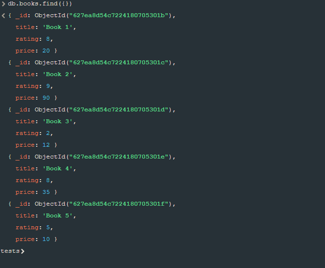
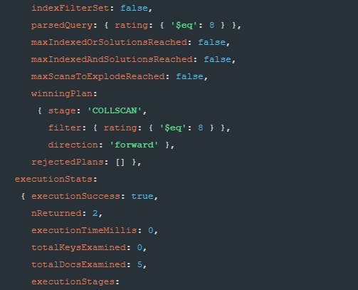
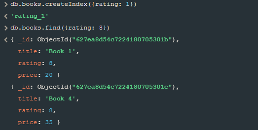
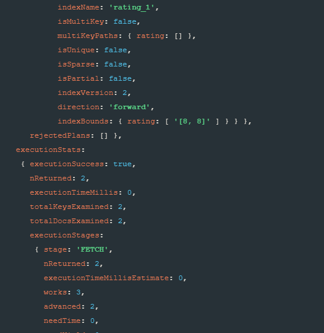

# MongoDB Indexes

In this tutorial you will learn about indexes in MongoDB.
What is their purpose? 
Let's take a look at definition from [MongoDB documentation](https://www.markdownguide.org/cheat-sheet/).

> Indexes support the efficient execution of queries in MongoDB. Without indexes, MongoDB must perform a collection scan, i.e. scan every document in a collection, to select those documents that match the query statement. If an appropriate index exists for a query, MongoDB can use the index to limit the number of documents it must inspect.

From this definition we deduce that when Mongo looks for a target documents it needs to scan the entire collection! So to optimize query exectuion we use indexes. 

> The index stores the value of a specific field or set of fields, ordered by the value of the field. The ordering of the index entries supports efficient equality matches and range-based query operations. In addition, MongoDB can return sorted results by using the ordering in the index.

Let's take a look at example. Database contains collection named **books** that has data about different books.

Now lets find all documents that have value **rating** set to 8.
After executing this query:

    db.books.find({rating: 8}).explain("executionStats")

I received data containing information about performance of my query.

This is the interesting part:

There is an information about returned documents and it is correct because indeed we have 2 documents with rating value set to 8. But what is even more interesting is the **totalDocsExamined** information that is set to 5. It is the total number of documents that Mongo needed to search to find the result.

So how can we optimize this?

I created index for the rating value and performed find query to show you that it works the same way - Mongo still returns 2 documents.

Wow - now the total number of documents scanned is only 2! That's because Mongo used the index to find these documents.

