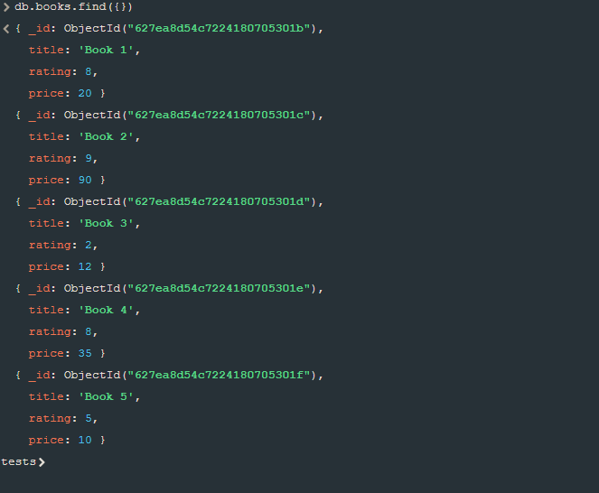
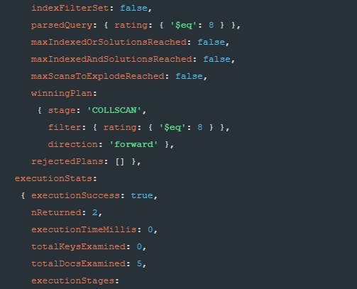
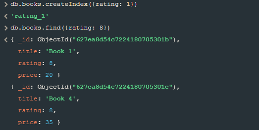
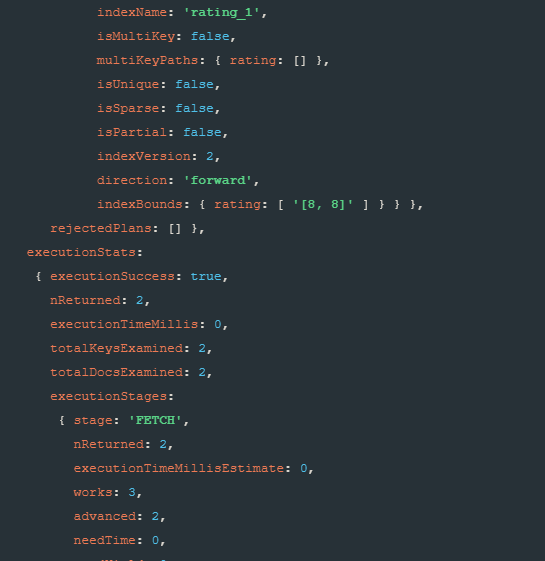

# MongoDB Indexes

In this tutorial you will learn about indexes in MongoDB.
What is their purpose? 
Let's take a look at definition from [MongoDB documentation](https://www.mongodb.com/docs/manual/indexes/).

> Indexes support the efficient execution of queries in MongoDB. Without indexes, MongoDB must perform a collection scan, i.e. scan every document in a collection, to select those documents that match the query statement. If an appropriate index exists for a query, MongoDB can use the index to limit the number of documents it must inspect.

From this definition we deduce that when Mongo looks for a target documents it needs to scan the entire collection! So to optimize query exectuion we use indexes. 

> The index stores the value of a specific field or set of fields, ordered by the value of the field. The ordering of the index entries supports efficient equality matches and range-based query operations. In addition, MongoDB can return sorted results by using the ordering in the index.

Let's take a look at example. Database contains collection named **books** that has data about different books.

Now lets find all documents that have value **rating** set to 8.
After executing this query:

    db.books.find({rating: 8}).explain("executionStats")

I received data containing information about performance of my query.

This is the interesting part:

There is an information about returned documents and it is correct because indeed we have 2 documents with rating value set to 8. But what is even more interesting is the **totalDocsExamined** information that is set to 5. It is the total number of documents that Mongo needed to search to find the result.

So how can we optimize this?

I created index for the rating value and performed find query to show you that it works the same way - Mongo still returns 2 documents.

Wow - now the total number of documents scanned is only 2! That's because Mongo used the index to find these documents.

## Types of indexes

These are examples of index types - for more information visit [MongoDB documentation](https://www.mongodb.com/docs/manual/indexes/#index-types):

- Single Field (the one in the example above)
- Compound Index (index that consists of multiple fields)
- Multikey Index (used for indexing content stored in arrays)
- Geospatial Index (for geospatial coordinate data)
- Text Indexes (indexing string content)
- Hashed Indexes (indexes hash of the value of a field)

## Index properties

- Unique Indexes (reject duplicate data for indexed field)
- Partial Indexes (index only documents that meet certain requirements)
- Sparse Indexes (index skips documents that do not have the indexed field)
- TTL Indexes (automatically remove documents after certain amount of time)
- Hidden Indexes (for hiding an index)

## Collation

When working with string data in a language other than english it is important to set collation. If I had german book titles, I would set collation for an index:

    db.books.createIndex({ title: 1 }, { collation: { locale: "de" }})

Check out this [collation locale list](https://www.mongodb.com/docs/manual/reference/collation-locales-defaults/) to find locale that interests you.

# Practice

Install mongodb module for node: `npm i`.
Now fire up your local MongoDB server and go to [index.js](./index.js).
There is an example covering TTL Index. Main function *(ttl_index)*:

- connects to the database
- creates **sessions** collection if it's possible
- creates ttl index on **creation_date** property
- inserts one document
- displays all data in the collection
- waits 60 seconds (index is set to remove after 10 seconds but Mongo checks for documents to remove every **60 seconds**)
- displays all data in the collection
- disconnects

### Exercise

    

    Now try to write a command that will create index on title in books collection where rating is higer than 7.
    Use this example as reference:
        
        db.restaurants.createIndex({ cuisine: 1 }, { partialFilterExpression: { score: { $lt: 5 } } })
    

Solution:

    db.books.createIndex({ title: 1 }, { partialFilterExpression: { rating: { $gt: 7 } } })

If you execute this command:

    db.books.find({title: "Book 3", rating: { $gt: 7 } })

and book's rating is not greater than 7 then Mongo won't even have to scan a single document to return you the empty result.

## Summary

Indexes are very useful for optimizing your database and can be really benefitting. As we saw today there are many types of indexes and they can have different properties that can be used for your advantage. So now experiment with them on your own and have an amazing day.

*Lucas Hazardous*